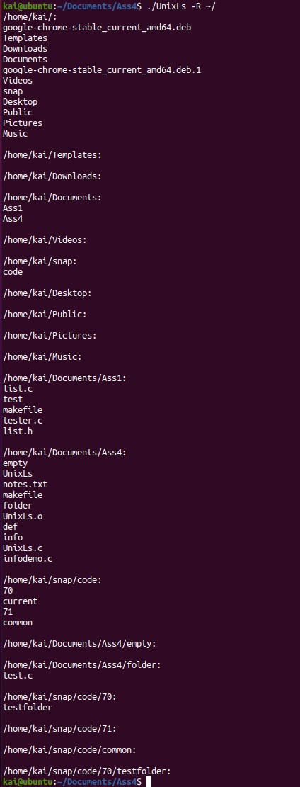

Recreation of the UNIX ls command.

Some features were ommited because they were not required in the assignment.
  
* Ordering of output might be different, but results and formatting are exactly same
* Does not include total
  
Ls command is implemented with the following options: 

* -i 
* -l 
* -R
  
# Samples of output from the ls program

  

